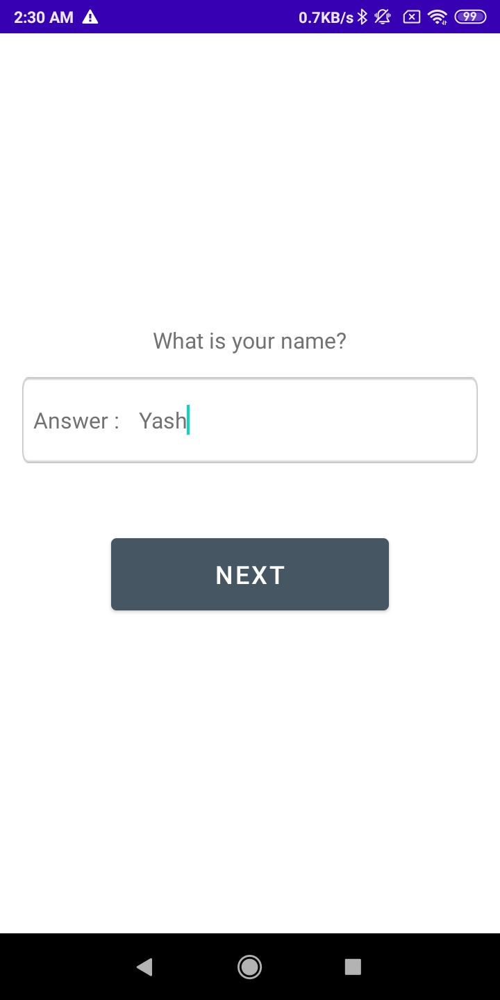
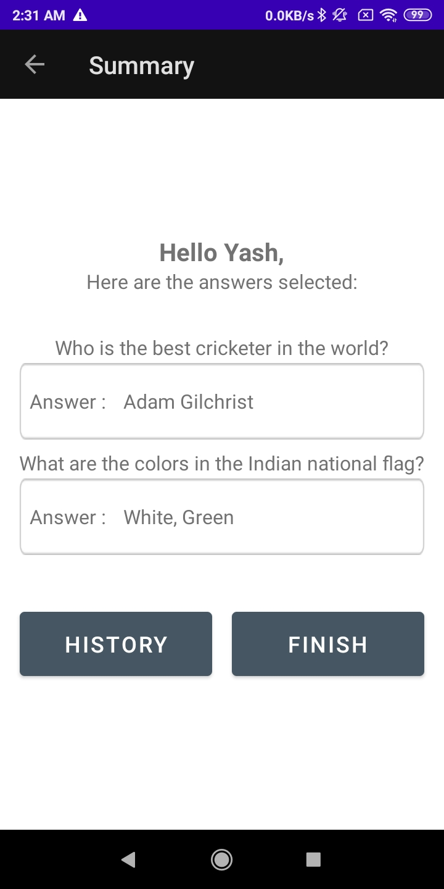
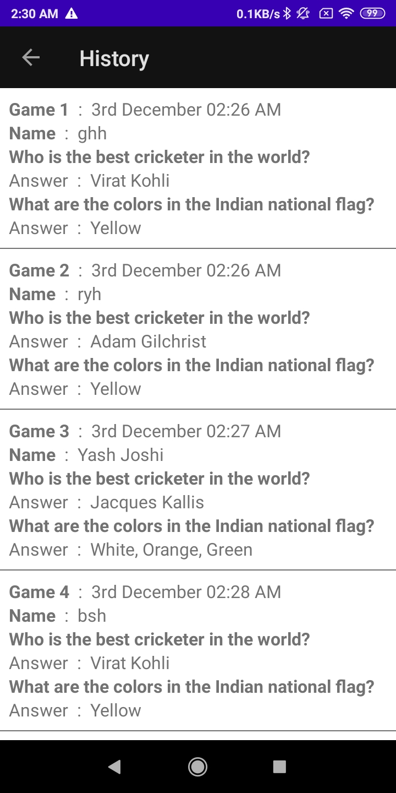

# Trivia App
 Simple app to take user inputs using different native android elements and display the data to the user using simple UI and lists. App also store a list of data in the local storage to display a list of previously entered data.
  

<b>Features:</b>
<ul>
  <li>Takes user input through different native android elements</li>
  <li>Display data with simple UI</li>
  <li>Show list of previously entered data</li>
  <li>Save list data to local storage</li>
</ul>

   
<h2>Screens: </h2> 

 
 
  

 
 
  

